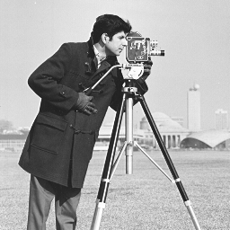
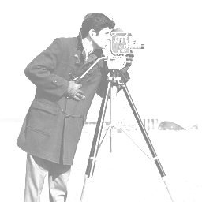
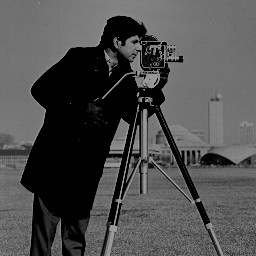

Image Processing Library created in C++

Reference: Udemy: Practical Image Processing in C/C ++ From Ground Up™   

## Things I've learned so far: 
 - Operations are done on each pixel but we might take into account the neighborhood for certain operations 
 - BMP image range is from 0-255 We can normalize if need be by the normalization equation or just make a hard max and min 
 - Operations like translation, rotation, reflection, scale, etc. are special cases of the affine transformation matrix
 - Linear Filtering uses a mask and slides the kernal over the image (hopefully I'm saying that right)
 - Linear Spacial Filtering is basically convolution 
 - Linear Filtering Steps: Define filter kernel -> Slide kernel over image -> Multiply pixels under the kernel by weights -> Copy resulting value to same location in new image

## Task List 
   
### Basic Setup/Stuff
- [x] Open and Copy Image 
- [x] ImageReader and ImageWritter Functions 
- [x] Image Processing Library Creation
### Arithmetic Operations
- [x] Original Image

- [x] Increasing Image Brightness (factor of 100)

- [x] Reducing Image Brightness (factor of 100)

### Histogram and Equalization
- [x] Computing Histogram of an Image (Testing, need to download GNU Plot for this)
- [x] Equalizing an Image Histogram (Testing in general)
### Geomatric Operations
- [ ] Rotating Images ( skipped but might come back to it)
### Gray Level Transformation
- [ ] Negative Transformation ( skipped but might come back to it)
### Image Enhancement Techniques
- [ ] Bluring an Image with a Filter Kernel
- [ ] Creating a Sepia Filter
### Edge Detection
- [ ] Detecting Lines with a Line Detector Mask
- [ ] Detecting Edges with the Prewitt Mask
- [ ] Detecting Edges with the Sobel Mask
- [ ] Detecting Edges with the Robinson Mask
- [ ] Detecting Edges with the Kirsch Mask
- [ ] Detecting Edges with the Laplacian Mask
- [ ] Detecting Edges with the Robert's Mask
### Neighborhood Processing
- [ ] Developing the 2-D Discrete Convolution Algorihtm
### Filter Algorihtms
- [ ] Adding Salt and Pepper Noise to an image 
- [ ] Performing High-pass Spatial Filtering
- [ ] Generating Gaussian Noise from an Image
- [ ] Developing the Maxium Filter Algorithm
- [ ] Developing the Median Filter Algorihtm
- [ ] Developing the Minimum Filter Algorithm 
Image Processing Library 
